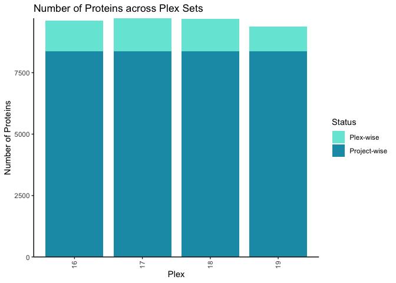
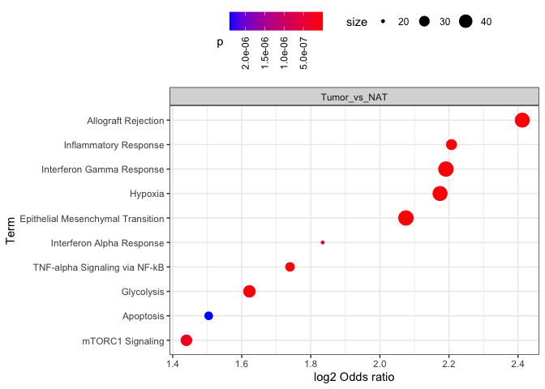

# FragPipeAnalystR

R package for FragPipe downstream analysis

Check [documentation](https://www.nesvilab.org/FragPipeAnalystR/) including several tutorials to get started.

## Installation

We recommend to use [renv](https://rstudio.github.io/renv/index.html) for managing your R environment dependencies

``` r
renv::install("bioc::ComplexHeatmap")
renv::install("bioc::limma")
renv::install("bioc::MSnbase")
renv::install("bioc::SummarizedExperiment")
renv::install("bioc::cmapR")
renv::install("bioc::ConsensusClusterPlus")
# latest version
renv::install("Nesvilab/FragPipeAnalystR@v1.0.3")
# or dev version
renv::install("Nesvilab/FragPipeAnalystR")

# optional
renv::install("nicolerg/ssGSEA2")
```

## Example

```
library(FragPipeAnalystR)
data("ccrcc", package = "FragPipeAnalystR")
```

### PCA

```
plot_pca(ccrcc)
```


### Correlation heatmap

```
plot_correlation_heatmap(ccrcc)
```


### Missing value heatmap

```
plot_missval_heatmap(ccrcc)
```


### Feature numbers

```
plot_feature_numbers(ccrcc)
```



### Box plot

```
plot_feature(ccrcc, c("CA9", "AHNAK2", "NDUFV2", "PIGR"))
```


### Differential expression analysis

```
de_result <- test_limma(ccrcc, type = "all")
de_result_updated <- add_rejections(de_result)
plot_volcano(de_result_updated, "Tumor_vs_NAT")
```


### Enrichment

``` {r include=T, warning=F}
or_result <- or_test(de_result_updated, database = "Hallmark", direction = "UP")
plot_or(or_result)
```




## Developer guide
- Start project `renv::init()`:
You may see message similar to this
```
* Using Bioconductor version '3.18'.
This project already has a lockfile. What would you like to do? 

1: Restore the project from the lockfile.
2: Discard the lockfile and re-initialize the project.
3: Activate the project without snapshotting or installing any packages.
4: Abort project initialization.
```
We recommend to choose 2 here to initialize the project since some dependencies depend on the R version and bioconductor version use
- You may use `lintr::lint_package()` and `styler::style_pkg()` to make sure coding styles consistent
- `devtools::build()` and `devtools::test()` to build and test the package, respectively
- `devtools::document()` when you add a function
- `usethis::use_import_from("package name", "function name")` to include dependencies
- `devtools::build_rmd("./vignettes/*.Rmd")` to build the tutorial Rmd file

## Reference
[Yi Hsiao, Haijian Zhang, Ginny Xiaohe Li, Yamei Deng, Fengchao Yu, Hossein Valipour Kahrood, Joel R. Steele, Ralf B. Schittenhelm, and Alexey I. Nesvizhskii
Journal of Proteome Research (2024), DOI: 10.1021/acs.jproteome.4c00294](https://pubs.acs.org/doi/10.1021/acs.jproteome.4c00294)

